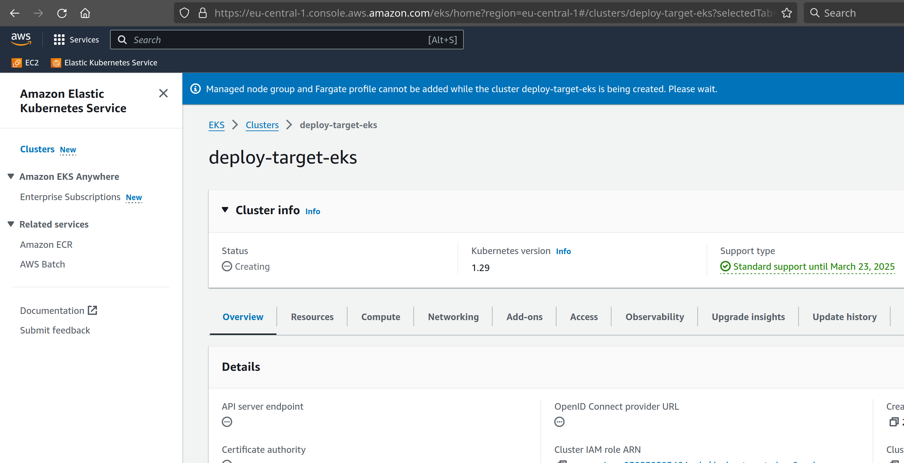
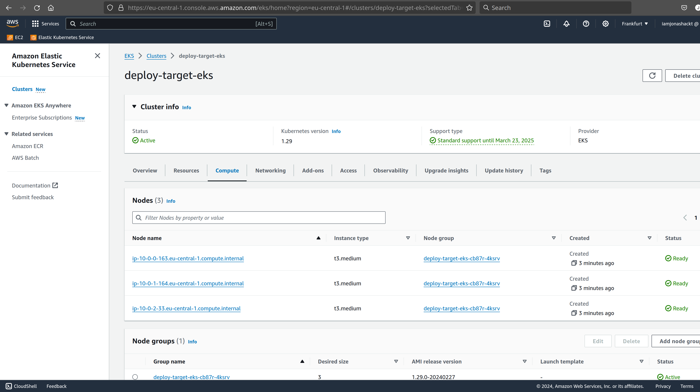
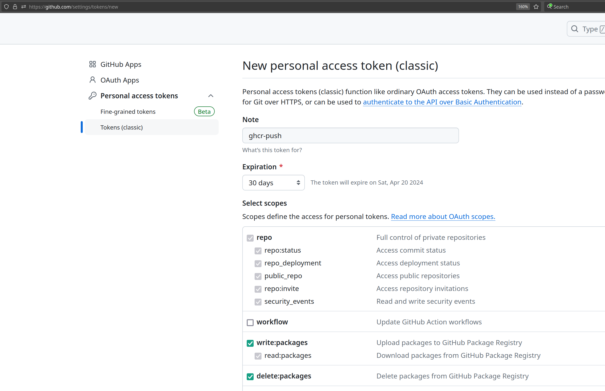
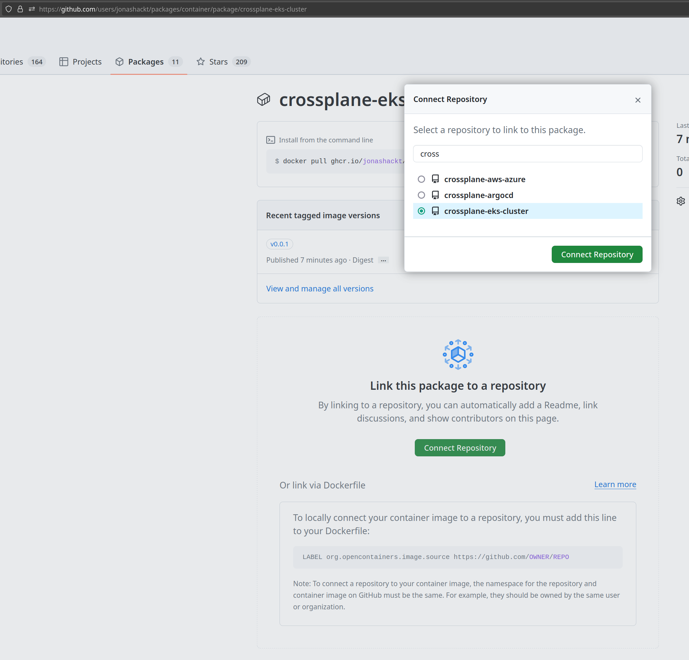
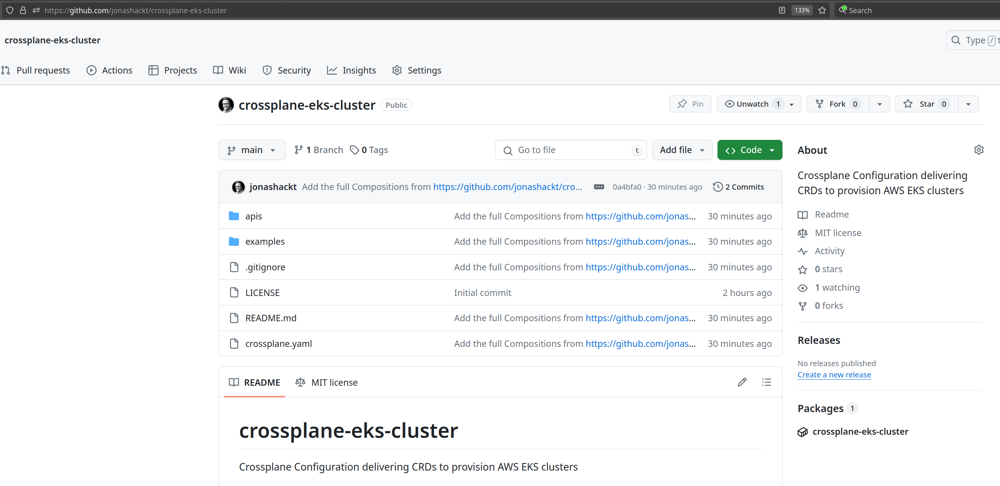
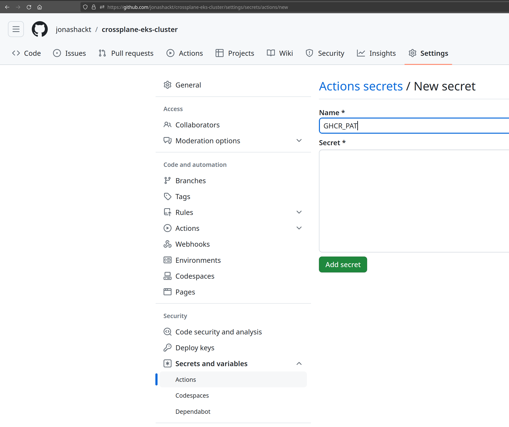

# crossplane-eks-cluster
[](https://github.com/jonashackt/crossplane-eks-cluster/actions/workflows/test-composition-and-publish-to-ghcr.yml)
[](https://github.com/jonashackt/crossplane-eks-cluster/blob/master/LICENSE)
[](https://renovatebot.com)

Crossplane Configuration delivering CRDs to provision AWS EKS clusters

This set of Crossplane (Nested) Compositions to provision a AWS EKS cluster was originally started in https://github.com/jonashackt/crossplane-argocd - but then scaled out to a separate repository using Crossplane's [Configuration Package feature](https://docs.crossplane.io/latest/concepts/packages/) to build a OCI image from the CRDs in this repo. 

For more info on Nested Compositions, see this post: https://vrelevant.net/crossplane-beyond-the-basics-nested-xrs-and-composition-selectors/

# How to use it

As described in https://docs.crossplane.io/latest/concepts/packages/#install-a-configuration use a manifest like the following to install the Configuration:

```yaml
apiVersion: pkg.crossplane.io/v1
kind: Configuration
metadata:
  name: crossplane-eks-cluster
spec:
  package: ghcr.io/jonashackt/crossplane-eks-cluster:v0.0.2
```

`apply -f` the file and create a Claim like shown in the `examples` folder at []`examples/claim.yaml`](examples/claim.yaml):

```yaml
apiVersion: k8s.crossplane.jonashackt.io/v1alpha1
kind: KubernetesCluster
metadata:
  namespace: default
  name: deploy-target-eks
spec:
  id: deploy-target-eks
  parameters:
    region: eu-central-1
    nodes:
      count: 3
  writeConnectionSecretToRef:
    name: eks-cluster-kubeconfig
```

Imagine a cluster (like the one bootstrapped in https://github.com/jonashackt/crossplane-argocd) and run `kubectl get crossplane`:

```shell
$ kubectl get crossplane
NAME                                    AGE
providerconfig.aws.upbound.io/default   7d3h

NAME                                                                          HEALTHY   REVISION   IMAGE                                                STATE    DEP-FOUND   DEP-INSTALLED   AGE
providerrevision.pkg.crossplane.io/provider-aws-ec2-150095bdd614              True      1          xpkg.upbound.io/upbound/provider-aws-ec2:v1.1.1      Active   1           1               7d3h
providerrevision.pkg.crossplane.io/provider-aws-eks-fbb6768e46c0              True      1          xpkg.upbound.io/upbound/provider-aws-eks:v1.1.1      Active   1           1               7d3h
providerrevision.pkg.crossplane.io/provider-aws-iam-9565c6312cd0              True      1          xpkg.upbound.io/upbound/provider-aws-iam:v1.1.1      Active   1           1               7d3h
providerrevision.pkg.crossplane.io/upbound-provider-family-aws-11fe5ecef831   True      1          xpkg.upbound.io/upbound/provider-family-aws:v1.1.1   Active                               7d4h

NAME                                                     INSTALLED   HEALTHY   PACKAGE                                              AGE
provider.pkg.crossplane.io/provider-aws-ec2              True        True      xpkg.upbound.io/upbound/provider-aws-ec2:v1.1.1      7d3h
provider.pkg.crossplane.io/provider-aws-eks              True        True      xpkg.upbound.io/upbound/provider-aws-eks:v1.1.1      7d3h
provider.pkg.crossplane.io/provider-aws-iam              True        True      xpkg.upbound.io/upbound/provider-aws-iam:v1.1.1      7d3h
provider.pkg.crossplane.io/upbound-provider-family-aws   True        True      xpkg.upbound.io/upbound/provider-family-aws:v1.1.1   7d4h

NAME                                                AGE
deploymentruntimeconfig.pkg.crossplane.io/default   7d4h

NAME                                        AGE    TYPE         DEFAULT-SCOPE
storeconfig.secrets.crossplane.io/default   7d4h   Kubernetes   crossplane-system
```

Now after applying this Configuration here, there should appear all the Compositions and XRDs:

```shell
$ kubectl get crossplane
NAME                                                                                                       ESTABLISHED   OFFERED   AGE
compositeresourcedefinition.apiextensions.crossplane.io/xeksclusters.eks.aws.crossplane.jonashackt.io      True          True      4s
compositeresourcedefinition.apiextensions.crossplane.io/xkubernetesclusters.k8s.crossplane.jonashackt.io   True          True      4s
compositeresourcedefinition.apiextensions.crossplane.io/xnetworkings.net.aws.crossplane.jonashackt.io      True          True      4s

NAME                                                                         REVISION   XR-KIND              XR-APIVERSION                               AGE
compositionrevision.apiextensions.crossplane.io/aws-eks-4c2092f              1          XEKSCluster          eks.aws.crossplane.jonashackt.io/v1alpha1   4s
compositionrevision.apiextensions.crossplane.io/kubernetes-cluster-2b6e754   1          XKubernetesCluster   k8s.crossplane.jonashackt.io/v1alpha1       4s
compositionrevision.apiextensions.crossplane.io/networking-3869153           1          XNetworking          net.aws.crossplane.jonashackt.io/v1alpha1   4s

NAME                                                         XR-KIND              XR-APIVERSION                               AGE
composition.apiextensions.crossplane.io/aws-eks              XEKSCluster          eks.aws.crossplane.jonashackt.io/v1alpha1   4s
composition.apiextensions.crossplane.io/kubernetes-cluster   XKubernetesCluster   k8s.crossplane.jonashackt.io/v1alpha1       4s
composition.apiextensions.crossplane.io/networking           XNetworking          net.aws.crossplane.jonashackt.io/v1alpha1   4s

NAME                                    AGE
providerconfig.aws.upbound.io/default   7d3h

NAME                                                                          HEALTHY   REVISION   IMAGE                                              STATE    DEP-FOUND   DEP-INSTALLED   AGE
configurationrevision.pkg.crossplane.io/crossplane-eks-cluster-edf0e1ba1b0c   True      1          ghcr.io/jonashackt/crossplane-eks-cluster:v0.0.2   Active   4           4               6s

NAME                                                     INSTALLED   HEALTHY   PACKAGE                                            AGE
configuration.pkg.crossplane.io/crossplane-eks-cluster   True        True      ghcr.io/jonashackt/crossplane-eks-cluster:v0.0.2   6s

NAME                                                                          HEALTHY   REVISION   IMAGE                                                STATE    DEP-FOUND   DEP-INSTALLED   AGE
providerrevision.pkg.crossplane.io/provider-aws-ec2-150095bdd614              True      1          xpkg.upbound.io/upbound/provider-aws-ec2:v1.1.1      Active   1           1               7d3h
providerrevision.pkg.crossplane.io/provider-aws-eks-fbb6768e46c0              True      1          xpkg.upbound.io/upbound/provider-aws-eks:v1.1.1      Active   1           1               7d3h
providerrevision.pkg.crossplane.io/provider-aws-iam-9565c6312cd0              True      1          xpkg.upbound.io/upbound/provider-aws-iam:v1.1.1      Active   1           1               7d3h
providerrevision.pkg.crossplane.io/upbound-provider-family-aws-11fe5ecef831   True      1          xpkg.upbound.io/upbound/provider-family-aws:v1.1.1   Active                               7d4h

NAME                                                     INSTALLED   HEALTHY   PACKAGE                                              AGE
provider.pkg.crossplane.io/provider-aws-ec2              True        True      xpkg.upbound.io/upbound/provider-aws-ec2:v1.1.1      7d3h
provider.pkg.crossplane.io/provider-aws-eks              True        True      xpkg.upbound.io/upbound/provider-aws-eks:v1.1.1      7d3h
provider.pkg.crossplane.io/provider-aws-iam              True        True      xpkg.upbound.io/upbound/provider-aws-iam:v1.1.1      7d3h
provider.pkg.crossplane.io/upbound-provider-family-aws   True        True      xpkg.upbound.io/upbound/provider-family-aws:v1.1.1   7d4h

NAME                                                AGE
deploymentruntimeconfig.pkg.crossplane.io/default   7d4h

NAME                                        AGE    TYPE         DEFAULT-SCOPE
storeconfig.secrets.crossplane.io/default   7d4h   Kubernetes   crossplane-system
```


# Building a Nested Composition for EKS with Crossplane

## Bootstrap a EKS cluster with Crossplane

https://marketplace.upbound.io/providers/upbound/provider-aws-eks/

Inspiration taken from https://github.com/cem-altuner/crossplane-prod-ready-eks (watch out, this is based on the crossplane aws provider!), https://github.com/upbound/configuration-eks 


### Add EKS and ECS Providers

We first need to add 2 more Crossplane Providers from the upbound provider families: `provider-aws-eks` and `provider-aws-ec2`.

[`upbound/provider-aws/provider/provider-aws-eks.yaml`](upbound/provider-aws/provider/provider-aws-eks.yaml):

```yaml
apiVersion: pkg.crossplane.io/v1
kind: Provider
metadata:
  name: provider-aws-eks
spec:
  package: xpkg.upbound.io/upbound/provider-aws-eks:v1.1.0
  packagePullPolicy: Always
  revisionActivationPolicy: Automatic
  revisionHistoryLimit: 1
```

and the [`upbound/provider-aws/provider/provider-aws-ec2.yaml`](upbound/provider-aws/provider/provider-aws-ec2.yaml):

```yaml
apiVersion: pkg.crossplane.io/v1
kind: Provider
metadata:
  name: provider-aws-ec2
spec:
  package: xpkg.upbound.io/upbound/provider-aws-ec2:v1.1.0
  packagePullPolicy: Always
  revisionActivationPolicy: Automatic
  revisionHistoryLimit: 1
```

Our already present Argo `Application` should be able to automatically pull the new Providers too without further changes:


### The EC2 Networking Composition

Can be found in `upbound/provider-aws/apis/networking`:

* XRD: [`upbound/provider-aws/apis/eks/definition.yaml`](upbound/provider-aws/apis/eks/definition.yaml)
* Composition: [`upbound/provider-aws/apis/networking/composition.yaml`](upbound/provider-aws/apis/networking/composition.yaml)

For the start, let's simply apply our first XRD, Composition and Claim manually like that:

```shell
# Networking XRD & Composition
kubectl apply -f upbound/provider-aws/apis/networking/definition.yaml
kubectl apply -f upbound/provider-aws/apis/networking/composition.yaml
# Precheck if Network works
kubectl apply -f upbound/provider-aws/apis/networking/claim.yaml 
```

I found that the simplest way to follow what Crossplane is doing, is to look into the events ( via typing `:events`) in k9s:


And simply press `ENTER` to see the actual event message. This helped me a lot in the development process (no need to run `kubectl get crossplane` all the time and manually copy the CRD names to a `kubectl describe xyz-crd`).


Managed Resources need to reference other Managed Resources. For example, a `SecurityGroupRule` needs to reference a `SecurityGroup`:

```yaml
...
    ### SecurityGroups & Rules
    - name: securitygroup-nodepool
      base:
        apiVersion: ec2.aws.upbound.io/v1beta1
        kind: SecurityGroup
        spec:
          forProvider:
            description: Cluster communication with worker nodes
            name: securitygroup-nodepool
            vpcIdSelector:
              matchControllerRef: true

      patches:
        - type: PatchSet
          patchSetName: networkconfig
        - fromFieldPath: spec.id
          toFieldPath: metadata.name
          # provide the securityGroupId for later use as status.securityGroupIds entry
        - type: ToCompositeFieldPath
          fromFieldPath: metadata.annotations[crossplane.io/external-name]
          toFieldPath: status.securityGroupIds[0]

    - name: securitygroup-nodepool-rule
      base:
        apiVersion: ec2.aws.upbound.io/v1beta1
        kind: SecurityGroupRule
        spec:
          forProvider:
            type: egress
            cidrBlocks:
              - 0.0.0.0/0
            fromPort: 0
            protocol: tcp
            securityGroupIdSelector:
              matchLabels:
                net.aws.crossplane.jonashackt.io: securitygroup
            toPort: 0
      patches:
        - type: PatchSet
          patchSetName: networkconfig
          ...
```

In this example, we get the following error in our k8s events:

```shell
cannot resolve references: mg.Spec.ForProvider.SecurityGroupID: no resources matched selector
```

https://docs.crossplane.io/latest/concepts/managed-resources/#referencing-other-resources states

> Some fields in a managed resource may depend on values from other managed resources. For example a VM may need the name of a virtual network to use.

> Managed resources can reference other managed resources by external name, name reference or selector.

The problem is, we don't specify the `net.aws.crossplane.jonashackt.io: securitygroup` label on our `SecurityGroup`! Doing that the problem is gone:

```yaml
        kind: SecurityGroup
        metadata:
          labels:
            net.aws.crossplane.jonashackt.io: securitygroup
```


There should now be an event showing up containing `Successfully composed resources` in our `eks-vpc-j8s5k` XR.


### The EKS Cluster Composition

Can be found in `upbound/provider-aws/apis/eks`:

* XRD: [`upbound/provider-aws/apis/eks/definition.yaml`](upbound/provider-aws/apis/eks/definition.yaml)
* Composition: [`upbound/provider-aws/apis/eks/composition.yaml`](upbound/provider-aws/apis/eks/composition.yaml)

For testing we simply use `kubectl apply -f`:


```shell
# EKS XRD & Composition
kubectl apply -f upbound/provider-aws/apis/eks/definition.yaml
kubectl apply -f upbound/provider-aws/apis/eks/composition.yaml

# If you choose this example (non-nested) claim, be sure to change the subnetIds and securitygroupid according the the Networking claim executed before!

# Precheck if EKSCluster works
kubectl apply -f upbound/provider-aws/apis/eks/claim.yaml 
```

Errors in the events like this are normal, since the EKS Cluster needs it's time to be provisioned before NodeGroups etc. can be assigned:

```shell
cannot resolve references: mg.Spec.ForProvider.ClusterName: referenced field was empty (referenced resource may not yet be ready) 
```

This also shows up in the AWS console:




Now if the `NodeGroup` comes up with the following

```shell
cannot resolve references: mg.Spec.ForProvider.SubnetIds: no resources matched selector 
```

there's a problem, where the NodeGroup can't find it's SubnetIds.

```yaml
    - name: nodeGroupPublic
      base:
        apiVersion: eks.aws.upbound.io/v1beta1
        kind: NodeGroup
        spec:
          forProvider:
            clusterNameSelector:
              matchControllerRef: true
            nodeRoleArnSelector:
              matchControllerRef: true
              matchLabels:
                role: nodegroup
            subnetIdSelector:
              matchLabels:
                access: public
            scalingConfig:
              - minSize: 1
                maxSize: 10
                desiredSize: 1
            instanceTypes: # TODO: we can support to have that parameterized also
              - t3.medium
      patches:
        - type: PatchSet
          patchSetName: clusterconfig
        - fromFieldPath: spec.parameters.nodes.count
          toFieldPath: spec.forProvider.scalingConfig[0].desiredSize
        - fromFieldPath: spec.id
          toFieldPath: spec.forProvider.subnetIdSelector.matchLabels[aws.crossplane.jonashackt.io/network-id]
          ...
```

That's because the label of all networking components changed to `net.aws.crossplane.jonashackt.io/network-id`. So let's fix that!

Now finally the NodeGroups are correctly assigned to the EKS cluster:

The `Successfully composed resources` message in the event `xekscluster/deploy-target-eks-cb87r` looks promising:




### The nested XR for Networking & EKS Cluster Compositions

Can be found in `upbound/provider-aws/apis`

* XRD: [`upbound/provider-aws/apis/definition.yaml`](upbound/provider-aws/apis/definition.yaml)
* Composition: [`upbound/provider-aws/apis/composition.yaml`](upbound/provider-aws/apis/composition.yaml)

With this Composition we're able to use both pre-defined Compositions `XNetworking` and `XEKSCluster` and thus implement a nested Composite Resource:

```yaml
apiVersion: apiextensions.crossplane.io/v1
kind: Composition
metadata:
  name: kubernetes-cluster
spec:
  compositeTypeRef:
    apiVersion: k8s.crossplane.jonashackt.io/v1alpha1
    kind: XKubernetesCluster
  
  writeConnectionSecretsToNamespace: crossplane-system

  resources:
    ### Nested use of XNetworking XR
    - name: compositeNetworkEKS
      base:
        apiVersion: net.aws.crossplane.jonashackt.io/v1alpha1
        kind: XNetworking
      patches:
        - fromFieldPath: spec.id
          toFieldPath: spec.id
        - fromFieldPath: spec.parameters.region
          toFieldPath: spec.parameters.region
        # provide the subnetIds & securityGroupIds for later use
        - type: ToCompositeFieldPath
          fromFieldPath: status.subnetIds
          toFieldPath: status.subnetIds
          policy:
            fromFieldPath: Required
        - type: ToCompositeFieldPath
          fromFieldPath: status.securityGroupIds
          toFieldPath: status.securityGroupIds
          policy:
            fromFieldPath: Required
    
    ### Nested use of XEKSCluster XR
    - name: compositeClusterEKS
      base:
        apiVersion: eks.aws.crossplane.jonashackt.io/v1alpha1
        kind: XEKSCluster
      connectionDetails:
        - fromConnectionSecretKey: kubeconfig
      patches:
        - fromFieldPath: spec.id
          toFieldPath: spec.id
        - fromFieldPath: spec.id
          toFieldPath: metadata.annotations[crossplane.io/external-name]
        - fromFieldPath: metadata.uid
          toFieldPath: spec.writeConnectionSecretToRef.name
          transforms:
            - type: string
              string:
                fmt: "%s-eks"
        - fromFieldPath: spec.writeConnectionSecretToRef.namespace
          toFieldPath: spec.writeConnectionSecretToRef.namespace
        - fromFieldPath: spec.parameters.region
          toFieldPath: spec.parameters.region
        - fromFieldPath: spec.parameters.nodes.count
          toFieldPath: spec.parameters.nodes.count
        - fromFieldPath: status.subnetIds
          toFieldPath: spec.parameters.subnetIds
          policy:
            fromFieldPath: Required
        - fromFieldPath: status.securityGroupIds
          toFieldPath: spec.parameters.securityGroupIds
          policy:
            fromFieldPath: Required
```

For the start, let's simply apply our first XRD, Composition and Claim manually like that:

```shell
# Nested XRD & Composition
kubectl apply -f upbound/provider-aws/apis/definition.yaml
kubectl apply -f upbound/provider-aws/apis/composition.yaml

# Check if full Cluster provisioning works
kubectl apply -f upbound/provider-aws/apis/claim.yaml 
```


### Accessing the Crossplane provisioned EKS cluster

https://docs.crossplane.io/knowledge-base/guides/connection-details/

In our eks cluster [claim](upbound/provider-aws/apis/eks/claim.yaml) we defined a 

```yaml
  writeConnectionSecretToRef:
    name: eks-cluster-kubeconfig
```

inside our nested claim. This will create a k8s `Secret` called `eks-cluster-kubeconfig`, where the kubeconfig will be stored.

Let's extract the kubeconfig:

```shell
kubectl get secret eks-cluster-kubeconfig -o jsonpath='{.data.kubeconfig}' | base64 --decode > ekskubeconfig
```

Now integrate the contents of the `ekskubeconfig` file into your `~/.kube/config` (better with VSCode!) and switch over to the new kube context e.g. using https://github.com/ahmetb/kubectx. If you're on the new context of our Crossplane bootstrapped EKS cluster, check if everything works:

```shell
$ kubectl get nodes
NAME                                          STATUS   ROLES    AGE   VERSION
ip-10-0-0-173.eu-central-1.compute.internal   Ready    <none>   34m   v1.29.0-eks-5e0fdde
ip-10-0-1-149.eu-central-1.compute.internal   Ready    <none>   34m   v1.29.0-eks-5e0fdde
ip-10-0-2-90.eu-central-1.compute.internal    Ready    <none>   34m   v1.29.0-eks-5e0fdde
```


# Testing the Managed Resources Rendering with kuttl

As described in this project: https://github.com/jonashackt/crossplane-kuttl we'll use https://kuttl.dev to create tests for our EKS Cluster Composition.

```shell
# Run kuttl tests
kubectl kuttl test
```

To run multiple tests, you don't need to setup kind and Crossplane incl. it's Providers every time simply run:

```shell
# Only once:
kubectl kuttl test --skip-cluster-delete
# and the following runs:
kubectl kuttl test --start-kind=false
```

Tests can be found in the exact reflective order as in `apis` under `tests/compositions`.

If an error occurs like `key is missing from map`:

```shell
case.go:366: resource VPC:/: .spec.forProvider.instanceTenancy: key is missing from map
```

one needs to delete that entry from the `01-assert.yaml`.

Even if something appears like 

```shell
resource Subnet:/: .metadata.labels.zone: value mismatch, expected: eu-central-1a != actual: eu-central-1b
```

Fix the `key is missing from map` first! Then the others might disappear.


Also for better readability, we run the kuttl tests one after another by using the `parallel: 1` configuration in the [`kuttl-test.yaml](kuttl-test.yaml):

```yaml
...
parallel: 1 # use parallel: 1 to execute one test after another (e.g. for better readability in CI logs)
```


# Building a Configuration Package as OCI container

https://docs.crossplane.io/latest/concepts/packages/#create-a-configuration

https://morningspace.medium.com/build-publish-and-install-crossplane-package-5e4b74a3ee37


### Install Crossplane CLI

https://github.com/crossplane/crossplane/releases/tag/v1.15.0

> Enhancements to the Crossplane CLI: New subcommands like `crossplane beta validate` for schema validation, `crossplane beta top` for resource utilization views similar to `kubectl top pods`, and `crossplane beta convert` for converting resources to newer formats or configurations.

Install crossplane CLI:

```shell
curl -sL "https://raw.githubusercontent.com/crossplane/crossplane/master/install.sh" |sh
```

If that produces an error like `Failed to download Crossplane CLI. Please make sure version current exists on channel stable.`, try to manually craft the download link:

```shell
curl --output crank "https://releases.crossplane.io/stable/current/bin/linux_amd64/crank"
chmod +x crank
sudo mv crank /usr/local/bin/crossplane
```

Be sure to have the `v1.15.0` version installed as a minimum, otherwise the `crossplane beta validate` command won't work:

```shell
crossplane --version
v1.15.0
```

### The crossplane.yaml

As [stated in the docs](https://docs.crossplane.io/latest/concepts/packages/#create-a-configuration) Crossplane has a feature where one can create Configuration Packages containing specific Compositions packaged in a OCI container. So let's build a Configuration Package from this EKS setup here.

First we need a [`crossplane.yaml`](crossplane.yaml):

```yaml
apiVersion: meta.pkg.crossplane.io/v1alpha1
kind: Configuration
metadata:
  name: crossplane-eks-cluster
  annotations:
    # Set the annotations defining the maintainer, source, license, and description of your Configuration
    meta.crossplane.io/maintainer: Jonas Hecht iam@jonashackt.io
    meta.crossplane.io/source: github.com/jonashackt/crossplane-eks-cluster
    # Set the license of your Configuration
    meta.crossplane.io/license: MIT
    meta.crossplane.io/description: |
      Crossplane Configuration delivering CRDs to provision AWS EKS clusters.
    meta.crossplane.io/readme: |
      It's a Nested Composition with separate AWS Networking & EKS cluster setups.
spec:
  dependsOn:
    - provider: xpkg.upbound.io/upbound/provider-aws-ec2
      version: ">=v1.1.1"
    - provider: xpkg.upbound.io/upbound/provider-aws-iam
      version: ">=v1.1.1"
    - provider: xpkg.upbound.io/upbound/provider-aws-eks
      version: ">=v1.1.1"
  crossplane:
    version: ">=v1.15.1-0"
```

Don't forget to add the `metadate.annotations` in order to prevent the error `crossplane: error: failed to build package: not exactly one package meta type` - see also https://stackoverflow.com/questions/78200917/crossplane-error-failed-to-build-package-not-exactly-one-package-meta-type

Also we should define on which providers our Configuration depends on - and also on which Crossplane version.


There's also a template one could use to create the crossplane.yaml using the crossplane CLI: https://docs.crossplane.io/latest/cli/command-reference/#beta-xpkg-init 

```shell
crossplane beta xpkg init crossplane-eks-cluster configuration-template
```

The command uses the following template: https://github.com/crossplane/configuration-template (one could provide arbitrary repositories to the command).


### Building the Package using Crossplane CLI

The Crossplane CLI [has the right command for us](https://docs.crossplane.io/latest/concepts/packages/#build-the-package):

```shell
crossplane xpkg build --package-root=. --examples-root="./examples" --ignore=".github/workflows/*,crossplane/install/*,crossplane/provider/*,kuttl-test.yaml,tests/compositions/eks/*,tests/compositions/networking/*" --verbose
```

Note that including YAML files that aren’t Compositions or CompositeResourceDefinitions, including Claims isn’t supported.

This can be done by appending `--ignore="file.xyz,directory/*"`, which will ignore a file `file.xyz` and all files in directory `directory`. [Sadly, ingoring directories completely isn't supported right now](https://docs.crossplane.io/latest/concepts/packages/#build-the-package) - so we need to define all our kuttl test directories respectively.

Also appending `--verbose` makes a lot of sense to see what's going on.


### Pushing the Package file .xpkg to GitHub Container Registry

There's also a `crossplane xpkg push` command to publish the Configuration package. So let's create a new GitHub package matching our repository:

```shell
crossplane xpkg push ghcr.io/jonashackt/crossplane-eks-cluster:v0.0.1
```

You can leverage the Container image tag as version number for your Configuration here.

If the command gives the following error, we need to setup Authentication for your Docker Registry:

```shell
crossplane: error: failed to push package file crossplane-eks-cluster-7badc365c06a.xpkg: Post "https://ghcr.io/v2/jonashackt/crossplane-eks-cluster/blobs/uploads/": GET https://ghcr.io/token?scope=repository%3Ajonashackt%2Fcrossplane-eks-cluster%3Apull&scope=repository%3Ajonashackt%2Fcrossplane-eks-cluster%3Apush%2Cpull&service=ghcr.io: DENIED: requested access to the resource is denied
```

The ` crossplane xpkg push --help` helps us:

> Credentials for the registry are automatically retrieved from xpkg
login and dockers configuration as fallback.

So we need to login to GitHub Container Registry first in order to be able to push our OCI image:

```shell
echo $CR_PAT | docker login ghcr.io -u YourAccountOrGHOrgaNameHere --password-stdin
```

Make sure to use a Personal Access Token as described in this post https://www.codecentric.de/wissens-hub/blog/github-container-registry with the following scopes (`repo`, `write:packages` and `delete:packages`):



Additionally we need to add the domain configuration like this: `--domain=https://ghcr.io`. Otherwise the default domain is `upbound.io` which will lead to non pushed Configurations - only visible via the `verbose` flag.

With this our `crossplane xpkg push` command should work as expected:

```shell
$ crossplane xpkg push ghcr.io/jonashackt/crossplane-eks-cluster:v0.0.1 --domain=https://ghcr.io --verbose

2024-03-21T16:39:48+01:00	DEBUG	Found package in directory	{"path": "crossplane-eks-cluster-7badc365c06a.xpkg"}
2024-03-21T16:39:48+01:00	DEBUG	Getting credentials for server	{"serverURL": "ghcr.io"}
2024-03-21T16:39:48+01:00	DEBUG	No profile specified, using default profile
2024-03-21T16:39:49+01:00	DEBUG	Pushed package	{"path": "crossplane-eks-cluster-7badc365c06a.xpkg", "ref": "ghcr.io/jonashackt/crossplane-eks-cluster:v0.0.1"}
```

Now head over to your GitHub Organisation's `Packages` tab and search for the newly created package:



Click onto the package and connect the GitHub Repository.

Also - on the right - click on `Package settings` and scroll down to the `Danger Zone`. There click on `Change visibility` and change it to public. Now your Crossplane Configuration should be available for download without login.

If everything went fine, the package / OCI image should now be visible at your repository:




### Build & Publish Crossplane Configuration Packages automatically with GitHub Actions

So let's finally do it all automatically on Composition code changes (git commit/push) using GitHub Actions. We simply extend our workflow at [.github/workflows/test-composition-and-publish-to-ghcr.yml](.github/workflows/test-composition-and-publish-to-ghcr.yml) and do all the steps from above:

```yaml
name: publish

on: [push]

env:
  GHCR_PAT: ${{ secrets.GHCR_PAT }}
  CONFIGURATION_VERSION: "v0.0.2"

jobs:
  resouces-rendering-test:
    ...

jobs:
  build-configuration-and-publish-to-ghcr:
    needs: resouces-rendering-test
    runs-on: ubuntu-latest

    steps:
      - uses: actions/checkout@v4

      - name: Login to GitHub Container Registry
        uses: docker/login-action@v3
        with:
          registry: ghcr.io
          username: ${{ github.actor }}
          password: ${{ secrets.GHCR_PAT }}

      - name: Install Crossplane CLI
        run: |
          curl -sL "https://raw.githubusercontent.com/crossplane/crossplane/master/install.sh" |sh
          sudo mv crossplane /usr/local/bin

      - name: Build Crossplane Configuration package & publish it to GitHub Container Registry
        run: |
          echo "### Build Configuration .xpkg file"
          crossplane xpkg build --package-root=. --examples-root="./examples" --ignore=".github/workflows/*,crossplane/install/*,crossplane/provider/*,kuttl-test.yaml,tests/compositions/eks/*,tests/compositions/networking/*" --verbose

          echo "### Publish as OCI image to GHCR"
          crossplane xpkg push "ghcr.io/jonashackt/crossplane-eks-cluster:$CONFIGURATION_VERSION" --domain=https://ghcr.io --verbose
```

As we added the `.github/workflows` directory with a workflow yaml file, the `crossplane xpkg build` command also tries to include it. Therefore the command locally need to exclude the workflow file also:

```shell
crossplane xpkg build --package-root=. --examples-root="./examples" --ignore=".github/workflows/*,crossplane/install/*,crossplane/provider/*,kuttl-test.yaml,tests/compositions/eks/*,tests/compositions/networking/*" --verbose
```

`--ignore=".github/*` won't work, since the command doesn't support to exclude directories - only wildcards IN directories.

Also to prevent the following error:

```shell
crossplane: error: failed to push package file crossplane-eks-cluster-7badc365c06a.xpkg: PUT https://ghcr.io/v2/jonashackt/crossplane-eks-cluster/manifests/v0.0.2: DENIED: installation not allowed to Write organization package
```

we use the Personal Access Token (PAT) we already created above also in our GitHub Actions Workflow instead of the default `GITHUB_TOKEN` in order to have the correct permissions. Therefore create it as a new Repository Secret:



With this we should also be able to use a ENV var for our Configuration version or even `latest`.